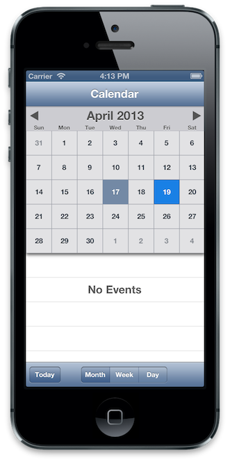
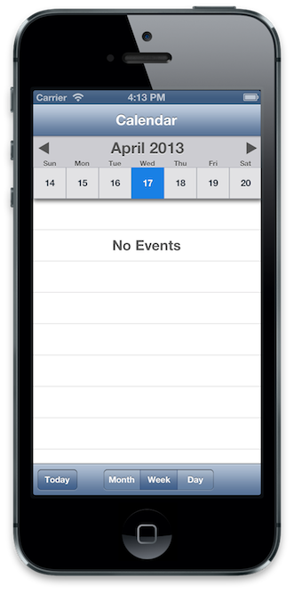
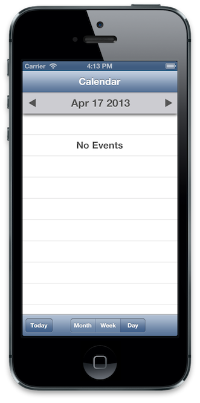

MBCalendarKit
================
MBCalendarKit is a calendar control written in UIKit. I've found existing implementations to be inadequate and difficult to work with, so I rolled my own.

Screenshots:
------------





Getting Started:
---------------

You'll need to set up the dependencies, described below. Alternatively, MBCalendarKit is now a registered CocoaPod. I don't use CocoaPods, but the process of listing it was simple enough, and it includes a check to ensure I did it correctly, so adding MBCalendarKit to your project as a pod is expected to work.


Dependencies:
-------------

You'll need the iOS 6 SDK. I haven't tested it against earlier versions of iOS. Your mileage may vary. (I'm pretty sure I used some NSCalendarUnit values that aren't defined before iOS 5. You'll also have to look at the table view cell implementation in `CKCalendarView.m`.) 

MBCalendarKit requires Quartz, Core Graphics, UIKit, and Foundation. The Unit Tests build against the SenTestingKit framework. Xcode should take care of all those except `QuartzCore.framework`. If you're building the tests, you may have to link to SenTestingKit yourself, as well.

Relevant Files:
---------------

Aside from the framework dependencies described above, you'll want everything in the CalendarKit folder. 

Showing a Calendar
--------------------------------------

You have two choices for showing a calendar using MBCalendarKit. 

1. You can show an instance of `CKCalendarView`. Use this if you want to manually manage your view hierarchy or have a finer control over your calendar view.


```` objective-c

/*
Here's how you'd show a CKCalendarView from within a view controller. 
It's just four easy steps.
*/
		
// 0. In either case, import CalendarKit:
#import "CalendarKit/CalendarKit.h"
    	
// 1. Instantiate a CKCalendarView
CKCalendarView *calendar = [CKCalendarView new];
 		
// 2. Optionally, set up the datasource and delegates
[calendar setDelegate:self];
[calendar setDataSource:self];
 		
// 3. Present the calendar 
[[self view] addSubview:calendar];
		
````


2. Your second option is to create an instance of `CKCalendarViewController`. Using a CKCalendarViewController gives you the added benefit of a "today" button and a segmented control in the toolbar, which allows you to select the display mode. Note that `CKCalendarViewController` subclasses `UINavigationViewController`, so it can't be installed inside of another navigation controller. 


```` objective-c

/* 
Here's how you'd show a CKCalendarViewController from 
within a view controller. It's just four easy steps.
*/
		
// 0. In either case, import CalendarKit:
#import "CalendarKit/CalendarKit.h"
    	
// 1. Instantiate a CKCalendarViewController
CKCalendarViewController *calendar = [CKCalendarViewController new];
 		
// 2. Optionally, set up the datasource and delegates
[calendar setDelegate:self];
[calendar setDataSource:self];
 		
// 3. Present the calendar 
[[self presentViewController:calendar animated:YES completion:nil];
		
````

---

**Note: From this point on, both the CKCalendarView class and the CKCalendarViewController classes are interchangeably referred to as the "calendar view", because they have common datasource and delegate APIs.** 

---


Supplying Data
-------------------------

The `CKCalendarDataSource` protocol defines the following method, which supplies an array of `CKCalendarEvent` objects. The calendar view automatically shows an indicator in cells that represent dates that have events. 

```` objective-c
- (NSArray *)calendarView:(CKCalendarView *)calendarView eventsForDate:(NSDate *)date;
````

You can read more about calendar events below.
		
		
Handling User Interaction
-------------------------

These methods, defined in the `CKCalendarViewDelegate` protocol, are called on the delegate when the used selects a date. A date is considered selected when either an arrow in the header is tapped, or when the user lifts their finger from a cell.

```` objective-c
- (void)calendarView:(CKCalendarView *)calendarView willSelectDate:(NSDate *)date;
- (void)calendarView:(CKCalendarView *)calendarView didSelectDate:(NSDate *)date;
````  

This method is called on the delegate when a row is selected in the events table. You can use to push a detail view, for example.

```` objective-c
- (void)calendarView:(CKCalendarView *)CalendarView didSelectEvent:(CKCalendarEvent *)event;
````   
    
Calendar Events
----------------
`CKCalendarEvent` is a simple data structure class which holds a title, a date, and an info dictionary. The calendar view will display automatically display `CKCalendarEvent` objects as passed to it by its delegate. If you have custom information that you want to show in a detail view, you can attach it to the event's `info` property.	


License:
========

MBCalendarKit is hereby released under the MIT License. 

Copyright (c) 2013 Moshe Berman

Permission is hereby granted, free of charge, to any person obtaining a copy of this software and associated documentation files (the "Software"), to deal in the Software without restriction, including without limitation the rights to use, copy, modify, merge, publish, distribute, sublicense, and/or sell copies of the Software, and to permit persons to whom the Software is furnished to do so, subject to the following conditions:

The above copyright notice and this permission notice shall be included in all copies or substantial portions of the Software.

THE SOFTWARE IS PROVIDED "AS IS", WITHOUT WARRANTY OF ANY KIND, EXPRESS OR IMPLIED, INCLUDING BUT NOT LIMITED TO THE WARRANTIES OF MERCHANTABILITY, FITNESS FOR A PARTICULAR PURPOSE AND NONINFRINGEMENT. IN NO EVENT SHALL THE AUTHORS OR COPYRIGHT HOLDERS BE LIABLE FOR ANY CLAIM, DAMAGES OR OTHER LIABILITY, WHETHER IN AN ACTION OF CONTRACT, TORT OR OTHERWISE, ARISING FROM, OUT OF OR IN CONNECTION WITH THE SOFTWARE OR THE USE OR OTHER DEALINGS IN THE SOFTWARE.


Thanks:
-------
Dave DeLong, for being an invaluable reference.
